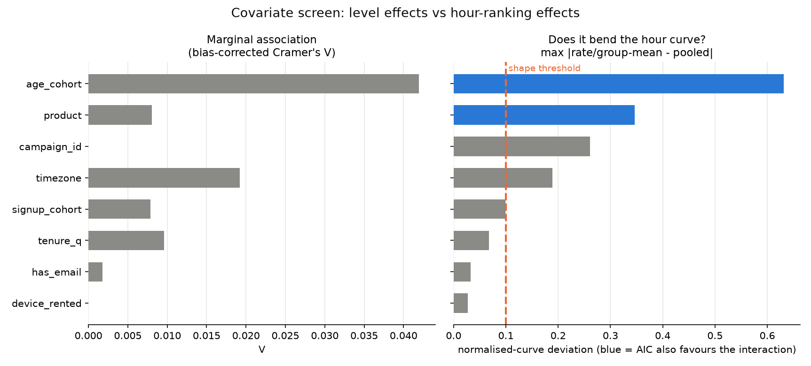
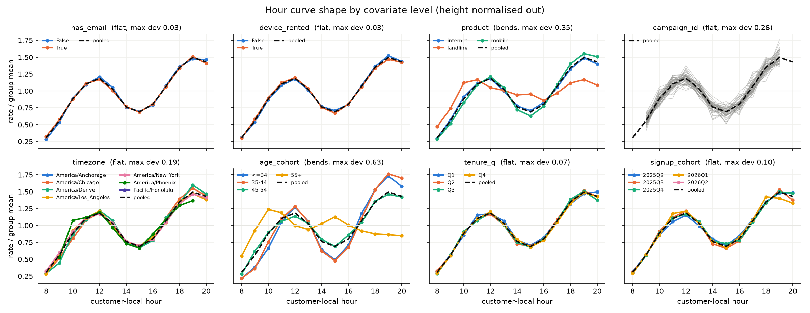
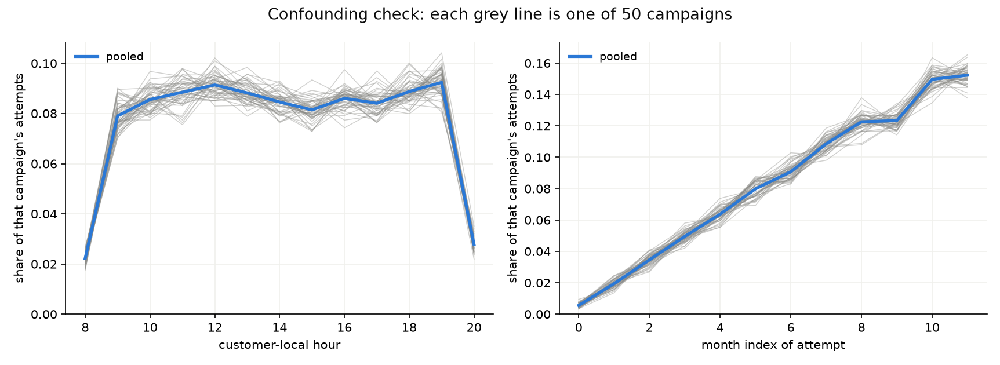

# Covariate screen: what survives, and what changes the hour ranking

Reproduce with `uv run python scripts/eda_covariates.py`.
Full numbers in [`stats.txt`](stats.txt).

The deliverable is a **per-user ranking of hours**, not a probability
level. So a covariate earns its place only if it changes *which* hour is
best, not if it moves a user's overall pick-up rate up or down. Every
covariate is therefore judged twice: marginally, and on whether it bends
the pick-up-versus-local-hour curve after the level effect is divided out.

## Verdict

`V` is bias-corrected Cramer's V against `picked_up`. `max dev` is the
largest gap between a group's normalised hour curve (rate / group mean)
and the pooled one, over cells with n >= 150. `AIC gain` is
AIC(hour + covariate) - AIC(hour x covariate); positive means the
interaction is worth its parameters.

| covariate | V | level spread | max dev | AIC gain | changes hour ranking? | call |
|---|---|---|---|---|---|---|
| `age` / `age_cohort` | **0.042** | 4.9 pp | **0.63** | **+3451** | **yes**, 60+ peak at 10:00 vs 19:00 | **KEEP** |
| `product` | 0.008 | 1.5 pp | 0.35 | +339 | apparent only; it is age (see below) | DROP, use `age` |
| `state` / `timezone` | 0.019 | 7.3 pp | 0.19 | -24 | no, same top-3 everywhere | DROP as a level feature; keep state for the UTC->local conversion |
| `campaign_id` | 0.000 | 3.1 pp | 0.26 | -626 | no, pure noise across 50 levels | DROP |
| `signup_date` (cohort) | 0.008 | 3.3 pp | 0.10 | -12 | no | DROP |
| `signup_date` (tenure days) | 0.010 | 1.3 pp | 0.07 | -33 | no | DROP |
| `has_email` | 0.002 | 0.3 pp | 0.03 | -7 | no | DROP |
| `device_rented` | 0.000 | 0.2 pp | 0.03 | -5 | no | DROP |
| `contract_id` | n/a | n/a | n/a | n/a | it is `user_id` | DROP |
| `contract_signup_date` | n/a | n/a | n/a | n/a | it is `signup_date` | DROP |
| `local_hour` (reference) | 0.207 | 39.4 pp | n/a | n/a | it *is* the ranking | KEEP |

**Only `age` changes the hour ranking.** Everything else is either a
level shift or noise.

## The decisive test in one picture

Normalised curves, so height is divided out and only shape is left. Seven
of eight panels sit on top of the pooled dashed curve. `age_cohort` does
not: under 55 the curve is bimodal with a strong 19:00 peak, while the
55+ group peaks at **10:00-12:00** and is flat-to-falling in the evening.
Best hour by cohort: `<=34` 19, `35-44` 19, `45-54` 19, `55+` **10**.

Scanning age at finer resolution, the flip is not gradual: it lands
between 60 and 65, and the `55+` bucket is a blend of both regimes.

| age band | n | best hour | top-3 | rate @10 | rate @19 |
|---|---|---|---|---|---|
| 30-35 | 33,624 | 19 | 19, 20, 18 | 0.234 | 0.579 |
| 45-50 | 17,827 | 20 | 20, 19, 18 | 0.321 | 0.475 |
| 55-60 | 11,504 | 20 | 20, 18, 19 | 0.331 | 0.415 |
| **60-65** | 8,309 | **10** | 10, 15, 11 | 0.512 | 0.231 |
| 65+ | 15,135 | **10** | 10, 11, 15 | 0.511 | 0.225 |

That looks like a retirement threshold: pre-60 users are reachable in the
evening, post-60 users in the late morning. Full table in `stats.txt`.

## Identifier and duplicate-column checks

| check | result |
|---|---|
| `contract_id == user_id` | 100% of rows |
| `contract_signup_date == signup_date` | 100% of rows |
| distinct contracts per user | always 1 |
| `is_first_contract` | always true |
| contract age vs tenure | numerically identical |

`contract_id` is a relabelled `user_id`. There is no contract hierarchy to
mine: no repeat contracts, no first-versus-later contrast, and the derived
contract-age feature is the same column as tenure. Both columns carry no
signal beyond being an ID.

## Confounding checks

**`product` is age.** Landline users average 55.9 years and 52% are 55+,
against 14% for mobile. Conditioning on age destroys the product
interaction and leaves the age interaction intact:

| stratum | AIC gain | best hour(s) |
|---|---|---|
| product within age `<=34` | -18 | 19 / 19 / 19 |
| product within age `35-44` | -24 | 19 / 19 / 19 |
| product within age `45-54` | -24 | 19 / 18 / 19 |
| product within age `55+` | -0 | 10 / 10 / 10 |
| age within `internet` | +1310 | 19, 19, 19, **10** |
| age within `landline` | +469 | 19, 19, 18, **10** |
| age within `mobile` | +1280 | 19, 19, 19, **10** |

**`campaign_id` is not tied to a time period or to which hours were
dialled.** All 50 campaigns are active in all 12 months, the campaign x
hour attempt table gives chi2 p = 0.85, campaign x month p = 0.85, and the
largest gap between any campaign's hour profile and the pooled profile is
1.3 pp on a base share of 7.7 pp. Nothing to credit or discount: the
observed rate range of 0.315 to 0.346 across campaigns is what 50 draws of
~3,470 Bernoulli trials at p = 0.33 look like.

**Calendar time.** Attempt volume grows steadily across the window (the
right panel above) and tenure correlates with calendar month at Spearman
0.47, so the mild "older signup cohorts pick up more" pattern (0.335 in
2025Q2 down to 0.302 in 2026Q2, n = 1,194 in the last bin) is mostly a
survivorship-of-cohort artifact. Monthly pick-up rate is flat at 0.325 to
0.342 with no trend worth modelling.

## Caveats

- **Repeated rows.** 173,579 attempts come from 9,719 users (median 18
  attempts each). Every test here treats correlated rows as independent,
  so the p-values are optimistic and the confidence intervals are too
  narrow. Read the effect sizes, not the stars. This is why the verdict
  column keys off `max dev` and AIC rather than significance.
- **Multiple testing.** Roughly 20 tests were run. At n = 173,579 almost
  anything reaches p < 0.05; `timezone` and `signup_cohort` both have
  "significant" interaction p-values (3e-4 and 1e-3) that AIC rejects.
- **Bias-corrected V.** Raw Cramer's V is inflated by level count alone,
  which would have made `campaign_id` (50 levels) and `state` (51) look
  meaningful. Bergsma's correction takes both to ~0.00 and 0.019.
- **Threshold choice.** "Bends the curve" needs both AIC gain > 0 and
  max dev >= 0.10, i.e. a 10% relative change in a group's hour profile.
  The threshold is a judgement call; `age` clears it by 6x, so nothing
  near the boundary changes the conclusion.

## Implications for modelling

Carry into the model:

1. `local_hour`, derived from `state` + `attempted_at_utc`. The whole
   signal is here.
2. `age`, as the only ranking-relevant modifier. Interact it with hour.
   The regime change sits near **60**, not 55, and it is sharp, so a
   hard split at 60 captures most of it. Let a tree find the exact cut
   rather than fixing it by hand.
3. `state` only as the timezone source, not as a level feature.

Drop: `has_email`, `device_rented`, `product`, `campaign_id`,
`contract_id`, `contract_signup_date`, `signup_date` and everything
derived from it. None of them changes which hour to call.

Practical consequence for the eval targets: for a user we have never
seen, age alone determines the predicted ranking, which is roughly
`[19, 20, 18]` under 60 and `[10, 11, 15]` at 60+.
