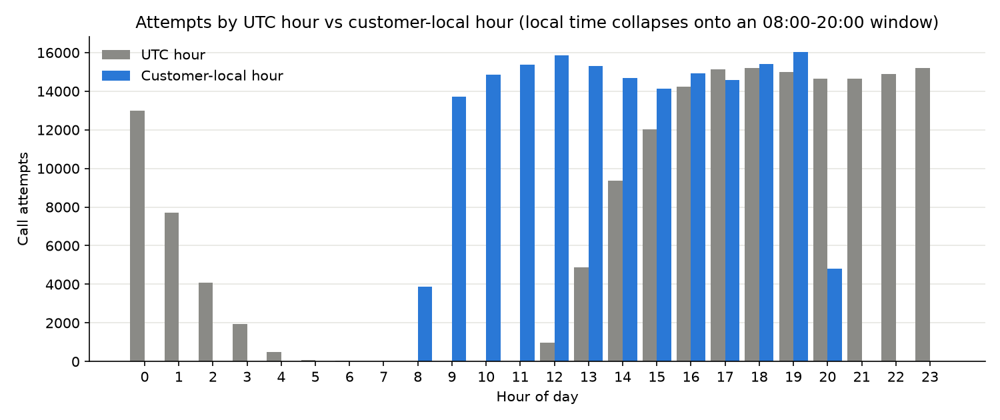
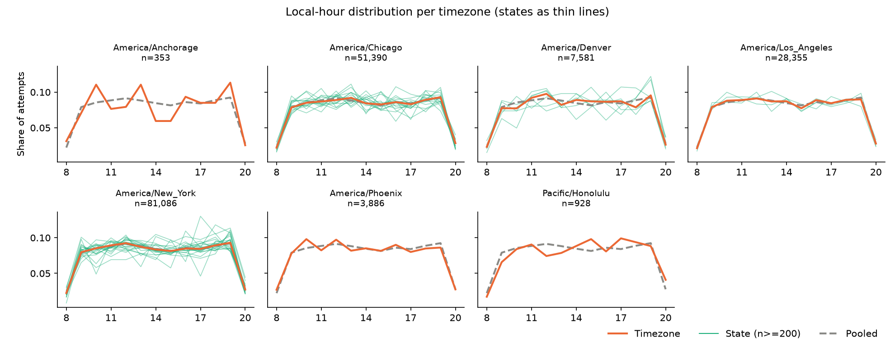
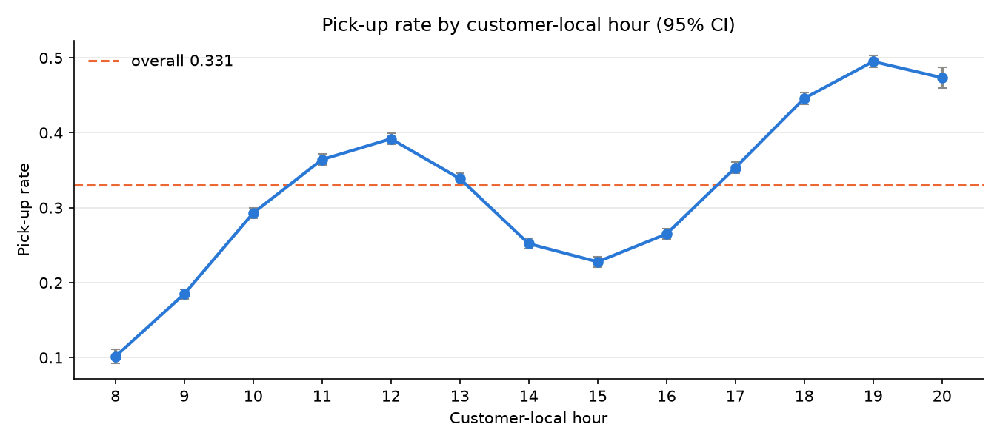

# EDA step 1: customer-local call time

**Question:** once `attempted_at_utc` is converted to the customer's own
wall clock, is the attempt time uniformly distributed, or is the historic
dialler already biased?

**Answer:** attempts are *not* uniform. They are confined to an
08:00-20:00 **local** window in every timezone. Within the interior of
that window (09-19) they are close to uniform, and the shape is the same
across states and timezones. So the bias is almost entirely "local
business hours", not "some states get called at different hours".

Reproduce: `uv run python scripts/eda_local_time.py`
(full numeric dump in [`stats.txt`](stats.txt)).

Code: [`src/challenge/feature.py`](../../src/challenge/feature.py) ·
tests: [`tests/test_feature.py`](../../tests/test_feature.py)

## 1. Mapping approach and caveats

`state_to_timezone()` maps each of the 50 states plus DC to an IANA zone
and `add_local_time()` converts with stdlib `zoneinfo`, grouping by zone
and calling `tz_convert` once per group (deterministic, no row-wise
apply, ~0.5 s on 173 k rows). It adds `timezone`, `local_datetime`,
`local_hour`, `local_dow`, `is_dst`, `utc_offset_hours`.

Data contains 51 distinct codes: the 50 states + `DC`. No `PR`, no
territories, no missing or unexpected values.

| Caveat | Detail |
|---|---|
| Multi-zone states | 13 states span >1 zone and are assigned their **majority-population** zone: `AK FL ID IN KS KY MI ND NE OR SD TN TX`. Users in the minority part of those states (e.g. the Florida panhandle, El Paso) get a 1 h error. |
| No-DST states | `AZ` -> `America/Phoenix`, `HI` -> `Pacific/Honolulu`. Their offset is constant all year (verified below). The Navajo Nation, which *does* observe DST inside AZ, is not modelled. |
| Unknown codes | Fall back to `America/New_York` rather than raising, so `predict.py` never dies on an unseen eval row. |
| ZIP-level truth | State is the finest geography we have; a ZIP-to-timezone table would remove the multi-zone approximation. |

## 2. UTC hour vs local hour

UTC hours used: 12-23 and 00-06 (nothing at 07-11 UTC).
Local hours used: **08-20 only**, in all seven zones.

Chi-square goodness of fit against uniform (n = 173,579):

| Distribution | support | chi2 | dof | p | Cramer's V |
|---|---|---|---|---|---|
| UTC hour | 0-23 | 141,134 | 23 | < 1e-300 | 0.188 |
| Local hour | 0-23 | 174,175 | 23 | < 1e-300 | 0.209 |
| Local hour | 8-20 (observed) | 14,788 | 12 | < 1e-300 | 0.084 |
| Local hour | 9-19 (interior) | 327 | 10 | 3.4e-64 | **0.014** |

Reading: neither is uniform over the full day. Restricted to the
interior of the calling window the local-hour distribution is
statistically non-uniform (huge n) but practically flat: every hour
09-19 sits between 8.1 % and 9.2 % of attempts (uniform = 9.1 %).
Hours 08 (2.2 %) and 20 (2.8 %) are partial edges of the window.

## 3. Do states and timezones agree?

Per-timezone local-hour share is in `stats.txt`. Distance from the
pooled distribution (support 8-20):

| Timezone | n | TVD | JSD (bits) |
|---|---|---|---|
| America/New_York | 81,086 | 0.004 | 0.0000 |
| America/Chicago | 51,390 | 0.007 | 0.0001 |
| America/Los_Angeles | 28,355 | 0.009 | 0.0001 |
| America/Denver | 7,581 | 0.027 | 0.0007 |
| America/Phoenix | 3,886 | 0.028 | 0.0009 |
| Pacific/Honolulu | 928 | 0.056 | 0.0036 |
| America/Anchorage | 353 | 0.085 | 0.0071 |

TVD tracks 1/sqrt(n) almost exactly, i.e. the deviations look like
sampling noise, not real differences. Chi-square tests of independence
agree: `local_hour x timezone` V = 0.011, `local_hour x state`
V = 0.021. Both are "significant" (p = 1.6e-4 and 9.6e-19) and both are
negligible in effect size.

State-level TVD vs pooled: median 0.037, p90 0.064, max 0.116. The eight
largest are all small-n states (`VT` 361, `RI` 347, `AK` 353, `WY` 524,
`DC` 236, `NH` 650, `NM` 746, `SD` 659). No state with n >= 1,000 exceeds
TVD 0.060. **No genuine outlier states.**

## 4. DST verification

`utc_offset_hours(state, ts)` for a summer (2025-07-15) and winter
(2026-01-15) instant:

| State | Zone | Summer | Winter |
|---|---|---|---|
| OH | America/New_York | -4 h | -5 h |
| CA | America/Los_Angeles | -7 h | -8 h |
| AZ | America/Phoenix | -7 h | **-7 h** |
| HI | Pacific/Honolulu | -10 h | **-10 h** |

Across the whole dataset each DST-observing zone shows exactly 2 distinct
offsets and a mix of `is_dst` True/False; Phoenix and Honolulu show 1
offset and `is_dst` False on all 4,814 rows. DST handling is correct.

## 5. Pick-up rate preview (the signal that matters)

Overall pick-up rate 0.331. By local hour:

| local hour | 8 | 9 | 10 | 11 | 12 | 13 | 14 | 15 | 16 | 17 | 18 | 19 | 20 |
|---|---|---|---|---|---|---|---|---|---|---|---|---|---|
| attempt share | .022 | .079 | .086 | .088 | .091 | .088 | .085 | .081 | .086 | .084 | .089 | .092 | .028 |
| pick-up rate | .102 | .185 | .293 | .364 | **.392** | .339 | .252 | .228 | .265 | .353 | .446 | **.495** | .473 |

The two curves are essentially unrelated (corr = 0.27 across 13 hours,
driven only by the thin 08/20 edges). Attempt counts are flat; pick-up
rate varies 5x, with a lunchtime bump at 12 local, a dip at 15, and the
best window at 18-20 local. `local_dow` shows no signal at all (rate
0.329-0.333 across all seven days, attempts flat).

## 6. Implications for modelling

1. **Model in local time, predict in UTC.** The response is a clean
   function of local hour; UTC hour only looks predictive because it
   proxies for timezone. Fit on `local_hour`, then invert per
   `(state, date)` to a UTC hour, applying the offset for *that* date so
   predictions near a DST boundary are right.
2. **Exposure bias is mild, so raw rates are usable.** Attempt counts are
   near-uniform over 09-19 local, so per-hour empirical pick-up rates are
   not badly confounded by dialler policy. No reweighting needed inside
   the window.
3. **Only 08-20 local is supported.** There is zero training data outside
   it, so restrict the candidate hour set to local 8-20 (equivalently,
   the state-specific UTC hours those map to) rather than all 24.
   Hours 08 and 20 are thin (n = 3.9 k / 4.8 k) and 08 is the worst hour
   anyway, so an 09-20 candidate set loses nothing.
4. **Pool across states.** State adds no information about *when* calls
   were attempted (V = 0.021), so state is useful only via its timezone
   for the UTC conversion, not as an hour-shape feature. That keeps the
   hour model low-variance.
5. **Drop day-of-week** from the time model unless it interacts with
   something else; marginally it is flat.
