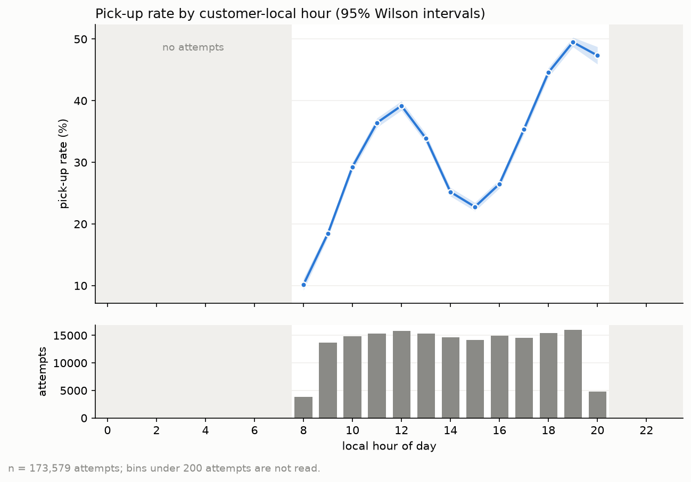
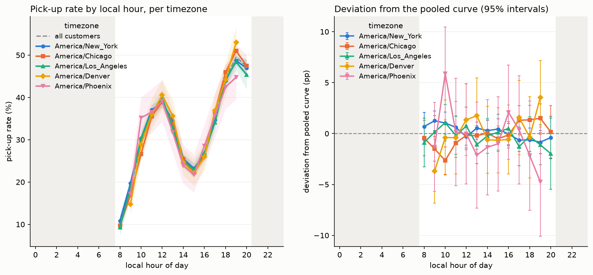
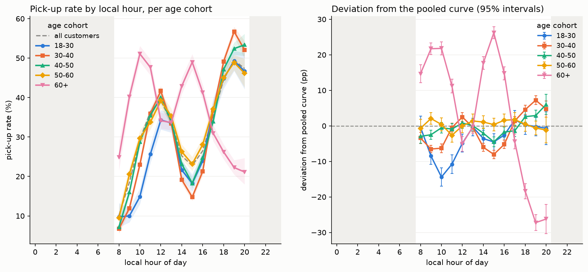

# Pick-up rate by local hour of day

EDA step 2. Reproduce with `uv run python scripts/eda_pick_curve.py`
(script: `scripts/eda_pick_curve.py`, raw numbers: `stats.txt`).

## What was measured

173,579 historic call attempts, overall pick-up rate 33.07%. UTC
timestamps were converted to customer-local wall clock with
`challenge.feature.add_local_time` (state to IANA zone, DST applied per
date). For every local hour we report the pick-up rate with a Wilson
score 95% interval and the underlying attempt count.

Thresholds used throughout:

| Rule | Value | Effect |
|---|---|---|
| Read a (group, hour) bin | n >= 200 | thin bins are plotted as gaps and excluded from peak/trough and tests |
| Keep a group at all | n >= 3,000 attempts | drops two timezones (below) |

All attempts fall in local hours 08-20, so hours 21-07 carry no
evidence at all. Hours 8 and 20 are only partly inside the calling
window (3,862 and 4,812 attempts vs about 15,000 for hours 9-19), so
they are real but sit at the edge of the covered range.

## Overall curve

The curve is strongly bimodal: a late-morning hump peaking at 12:00
and a bigger evening peak at 19:00, separated by a mid-afternoon
trough at 15:00.

| local hour | 8 | 9 | 10 | 11 | 12 | 13 | 14 | 15 | 16 | 17 | 18 | 19 | 20 |
|---|---|---|---|---|---|---|---|---|---|---|---|---|---|
| rate % | 10.2 | 18.5 | 29.3 | 36.4 | 39.2 | 33.9 | 25.2 | 22.8 | 26.5 | 35.3 | 44.6 | 49.5 | 47.3 |
| attempts | 3,862 | 13,721 | 14,854 | 15,360 | 15,863 | 15,314 | 14,681 | 14,134 | 14,934 | 14,596 | 15,407 | 16,041 | 4,812 |

Peak 19:00 (49.5%), trough 08:00 (10.2%), spread 39.3 pp. Restricted
to the fully covered hours 9-19 the spread is still 31.0 pp. Wilson
intervals are about +/- 0.8 pp wide at n = 15,000, so every visible
feature of this curve is far outside sampling noise.
Chi-square(hour x picked_up): chi2 = 7,417, dof = 12, p < 1e-300,
Cramer's V = 0.207.

## Timezone: the curves collapse

Dropped as too thin: `Pacific/Honolulu` (928 attempts) and
`America/Anchorage` (353). Kept:

| timezone | attempts | peak | peak % | trough | trough % | spread pp | vs pooled chi2 | dof | p | MAD pp | noise pp | ratio |
|---|---|---|---|---|---|---|---|---|---|---|---|---|
| America/New_York | 81,086 | 19 | 48.7 | 8 | 10.8 | 37.8 | 19 | 13 | 0.11 | 0.59 | 0.48 | 1.2 |
| America/Chicago | 51,390 | 19 | 51.0 | 8 | 9.7 | 41.3 | 34 | 13 | 0.001 | 0.84 | 0.60 | 1.4 |
| America/Los_Angeles | 28,355 | 19 | 48.4 | 8 | 9.3 | 39.1 | 8 | 13 | 0.81 | 0.74 | 0.81 | 0.9 |
| America/Denver | 7,581 | 19 | 53.0 | 9 | 14.8 | 38.2 | 12 | 11 | 0.39 | 1.36 | 1.43 | 0.9 |
| America/Phoenix | 3,886 | 19 | 44.8 | 9 | 17.2 | 27.6 | 12 | 11 | 0.34 | 1.93 | 2.01 | 1.0 |

Denver and Phoenix have 11 degrees of freedom rather than 13 because
their 08:00 and 20:00 bins fall under the 200-attempt threshold.

"MAD pp" is the mean absolute deviation from the pooled curve; "noise
pp" is what that deviation would be if the group followed the pooled
curve exactly and only sampling varied. A ratio near 1 means the group
is indistinguishable from pooled.

**Yes, they collapse.** Every kept zone peaks at local 19:00 and
troughs at local 08:00-09:00, four of the five sit at or below the
noise level, and no zone deviates by more than about 2 pp in any hour.
Chicago's p = 0.001 is a power artefact of n = 51,390: its MAD is
0.84 pp against 0.60 pp of noise, a difference too small to act on.
Since these zones are offset from each other by up to 3 hours in UTC,
a common curve in local time is direct evidence that **local hour, not
UTC hour, is the causal feature.** Phoenix (no DST) landing on the
same curve is a further check that the DST handling is right.

## Age cohort: one cohort is inverted

Ages run 23 to 95 (median 41), so the "18-30" cohort is really 23-30.
Edges were kept at 30/40/50/60 because a single-year scan puts the
behavioural break at exactly age 60: morning vs evening rate is
27.0% / 46.9% at age 59 and 42.7% / 21.7% at age 60 (`stats.txt`,
"AGE COHORT EDGE"). Bins are left-closed, so age 60 falls in "60+".

| cohort | attempts | peak | peak % | trough | trough % | spread pp | vs pooled chi2 (dof 13) | p | MAD pp | noise pp | ratio |
|---|---|---|---|---|---|---|---|---|---|---|---|
| 18-30 | 15,145 | 19 | 49.3 | 8 | 9.7 | 39.6 | 281 | 3e-52 | 4.06 | 1.10 | 3.7 |
| 30-40 | 63,457 | 19 | 56.7 | 8 | 6.7 | 50.0 | 831 | 3e-169 | 4.37 | 0.54 | 8.1 |
| 40-50 | 42,878 | 20 | 53.4 | 8 | 7.2 | 46.2 | 123 | 5e-20 | 2.23 | 0.66 | 3.4 |
| 50-60 | 26,947 | 19 | 48.9 | 8 | 9.5 | 39.4 | 24 | 0.03 | 1.09 | 0.83 | 1.3 |
| 60+ | 25,152 | 10 | 51.1 | 20 | 21.1 | 30.0 | 4,063 | < 1e-300 | 16.12 | 0.87 | 18.5 |

Pick-up rate by local hour and cohort (%), the table view of the plot:

| cohort | 8 | 9 | 10 | 11 | 12 | 13 | 14 | 15 | 16 | 17 | 18 | 19 | 20 |
|---|---|---|---|---|---|---|---|---|---|---|---|---|---|
| 18-30 | 9.7 | 10.0 | 14.9 | 25.6 | 34.3 | 33.6 | 21.6 | 18.2 | 23.9 | 37.0 | 44.8 | 49.3 | 46.7 |
| 30-40 | 6.7 | 12.0 | 23.0 | 35.9 | 41.7 | 33.4 | 19.2 | 14.7 | 21.3 | 36.7 | 49.1 | 56.7 | 52.1 |
| 40-50 | 7.2 | 16.0 | 28.7 | 35.5 | 40.0 | 33.9 | 23.1 | 18.3 | 24.7 | 33.9 | 47.2 | 52.4 | 53.4 |
| 50-60 | 9.5 | 20.5 | 29.7 | 33.8 | 39.2 | 35.3 | 26.3 | 23.1 | 28.1 | 37.1 | 45.1 | 48.9 | 46.2 |
| 60+ | 24.8 | 40.2 | 51.1 | 47.7 | 34.1 | 33.7 | 42.9 | 49.0 | 41.3 | 30.9 | 26.2 | 22.3 | 21.1 |
| all | 10.2 | 18.5 | 29.3 | 36.4 | 39.2 | 33.9 | 25.2 | 22.8 | 26.5 | 35.3 | 44.6 | 49.5 | 47.3 |

Findings:

1. **Under 60, everyone shares one shape.** Working-age cohorts all
   peak at 19:00-20:00 with a 15:00 trough. The differences between
   them are real (large chi-square) but are amplitude, not phase: the
   younger the cohort, the flatter the morning hump (18-30 reaches
   only 14.9% at 10:00 vs 29.7% for 50-60), and 30-40 has the sharpest
   evening peak (56.7%). 50-60 is essentially the pooled curve
   (ratio 1.3).
2. **60+ is inverted, not merely shifted.** It peaks at 10:00 (51.1%)
   and again at 15:00 (49.0%), dips over lunch (33.7% at 13:00), and
   falls to its worst hour of the day at 19:00-20:00 (22.3% / 21.1%),
   exactly where everyone else peaks. Deviation from pooled reaches
   +26.2 pp at 15:00 and -27.2 pp at 19:00, against 0.87 pp of noise,
   a ratio of 18.5. This is a phase-of-life effect, most plausibly
   retirement: no commute, at home during the day, out or unavailable
   in the evening.
3. Calling a 60+ customer at the population-optimal hour (19:00)
   instead of their own optimum (10:00) costs about 29 pp of pick-up
   probability. Age is not a nuisance covariate here, it changes the
   ranking of hours.

## Side checks

**Attempt volume.** Over the fully covered hours 9-19 the attempt
count varies by only 17% (13,721 to 16,041) while the rate varies by
31.0 pp, so volume cannot generate the curve even though the two are
correlated across hours (r = 0.89 on core hours, 0.27 over all 13).
Controlling within hour, splitting each hour's days into busy and
quiet halves changes the rate by 0.93 pp on average. No meaningful
confounding.

**Weekday vs weekend.** Overall rates are 33.0% (weekday, n = 124,242)
and 33.1% (weekend, n = 49,337). Both peak at 19:00 and trough at
08:00 with spreads of 39.1 and 40.0 pp. Against the pooled curve,
weekday chi2 = 5 (p = 0.98) and weekend chi2 = 12 (p = 0.55): the
shape is unchanged. Day of week looks like a non-feature for hour
ranking, though it is worth one more look interacted with age.

## Caveats

- Hours 21-07 local have zero attempts. Any model that must rank all
  24 hours is extrapolating there, and the curve is clearly still
  rising into 08:00 for 60+ customers, so their true peak may sit
  earlier than 10:00.
- One timezone per state is an approximation. 13 states span two
  zones (see `challenge.feature.MULTI_ZONE_STATES`); those users get
  the majority zone, which adds a 1 hour error for a minority of rows
  and would slightly blur, never sharpen, the timezone collapse.
- Hawaii and Alaska were dropped for thinness, so the collapse is
  demonstrated across five zones spanning UTC-4 to UTC-8, not all
  seven.
- The chi-square against the pooled curve is mildly conservative
  because each group also contributes to the pooled rates; the
  largest groups are the most affected, and their p-values are
  already extreme.
- These are marginal curves. Age, product, campaign and tenure are
  not held constant, so part of a cohort gap could ride on an
  associated variable. The 60+ inversion is far too large and too
  sharply keyed to age 60 to be explained that way.

## Implications for modelling

1. **Model in local hour, then map back to UTC for output.** The
   timezone collapse says the hour effect is a property of the
   customer's wall clock. Feed `local_hour` (plus its cyclical
   encoding) rather than UTC hour, and convert the chosen local hours
   to UTC per user at prediction time.
2. **Do not use a linear hour term.** The pooled curve is bimodal
   with a mid-afternoon trough. Use hour as a categorical, a spline,
   or a tree split.
3. **Interact hour with age, and give the model an `age >= 60`
   feature.** A model with additive age and hour terms cannot express
   an inverted curve, and would send retirement-age customers into
   their worst hour. The break is a step at 60, not a gradient, so a
   binary flag plus the hour interaction captures most of it cheaply.
4. **Skip day of week for hour ranking**, at least as a main effect.
5. **Do not trust predictions for local hours 21-07.** Either
   restrict the candidate hours to the observed window or add a prior
   that pushes unobserved hours down.
